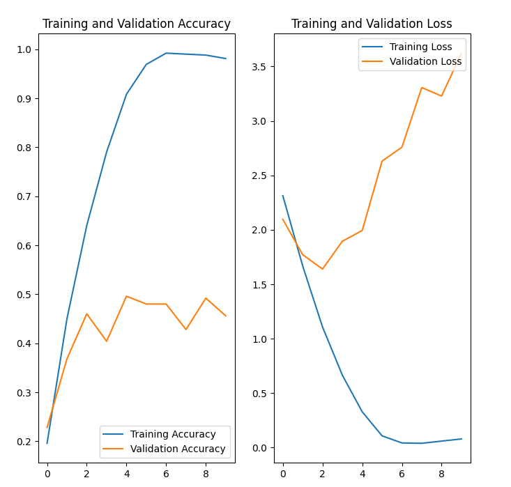

# Классификация опасных растений

## Содержание

1. [Описание проекта](#описание-проекта)
2. [Виды растений](#виды-растений)
3. [Руководство по использованию](#руководство-по-использованию)
4. [Работа с предобученной моделью](#работа-с-предобученной-моделью)
   - [Шаг 1: Установка компонентов](#шаг-1-установка-всех-необходимых-компонентов)
   - [Шаг 2: Укажите путь к модели](#шаг-2-укажите-путь-к-модели)
   - [Шаг 3: Вставьте URL-ссылку на изображение](#шаг-3-вставьте-url-ссылку-на-изображение)
5. [Обучение модели](#обучение-модели)
   - [Шаг 1: Установка компонентов](#шаг-1-установка-всех-необходимых-компонентов-1)
   - [Шаг 2: Загрузка датасета](#шаг-2-загрузка-датасета)
   - [Шаг 3: Обновление датасета](#шаг-3-обновление-датасета-опционально)
   - [Шаг 4: Обучение модели](#шаг-4-обучение-модели)
   - [Шаг 5: Сохранение модели](#шаг-5-сохранение-модели)
6. [Планируемые улучшения](#планируемые-улучшения)
7. [Обратная связь](#обратная-связь)

## Описание проекта

Ежегодно тысячи случаев отравлений происходят из-за случайного контакта с ядовитыми растениями:

🐱 Кошки - острая почечная недостаточность от лилий

👶 Дети - отравления ягодами и листьями при играх на природе

🐕 Собаки - желудочно-кишечные расстройства от поедания декоративных растений

🥾 Туристы и грибники - случайное употребление токсичных растений в пищу

🌱 Садоводы - контактный дерматит и отравления при уходе за растениями

Модель определяет опасные растения по фотографии. На данный момент модель определяет растения из 11 видов.

Модель может послужить основой для:

- Мобильных приложений для родителей и детей;
- Telegram-ботов для быстрой проверки растений;
- Веб-интерфейсов для детального анализа.

## Виды растений

**Лилия (Lilie)**: Кошки, проглотившие лилии, могут получить острую почечную недостаточность, которая может стать опасной для жизни, если не принять срочные меры.

**Абрус молитвенный (Abrus precatorius)**: Это крайне опасное растение из-за сильного токсина абрина, который может быть смертельным даже в малых количествах при проглатывании или попадании в организм путем инъекции.

**Диффенбахия(Dieffenbachia)**, широко известная как "немой тростник", опасна своим ядовитым соком, который при контакте с кожей или слизистыми оболочками может вызвать сильное раздражение и отек.

**Наперстянка пурпурная (Foxglove или Digitalis purpurea)** — высокоопасное растение, так как ее листья содержат мощные сердечные гликозиды, которые при приеме в больших количествах могут вызвать потенциально смертельные нарушения сердечного ритма.

**Ландыш (Lily of the Valley или Convallaria majalis)** считается опасным из-за наличия сердечных гликозидов в его листьях, цветках и ягодах, которые при проглатывании могут вызвать серьезные нарушения сердечной деятельности.

**Катарантус розовый (Catharanthus roseus, или Барвинок розовый)** содержит токсичные алкалоиды, которые могут оказывать вредное воздействие на сердечно-сосудистую и нервную системы при употреблении в больших количествах, что делает его опасным растением.

**Олеандр (Nerium oleander)** — крайне опасное растение из-за наличия токсичных сердечных гликозидов в его листьях, стеблях и цветках, которые могут вызвать тяжелое отравление и потенциально быть смертельными при проглатывании.

**Потос (Pothos или Epipremnum aureum)** считается опасным, так как все части растения содержат кристаллы оксалата кальция, которые при разжевывании или проглатывании могут вызвать раздражение и отек рта, горла и пищеварительного тракта.

**Листья ревеня (Rhubarb или Rheum rhabarbarum)** содержат высокий уровень щавелевой кислоты, что делает их опасными при употреблении в больших количествах, так как это может привести к повреждению почек и другим серьезным осложнениям для здоровья.

**Глициния (Wisteria)** может быть опасна из-за наличия токсичных лектинов в ее семенах, стручках и цветах, которые при проглатывании могут вызвать расстройство пищеварения, тошноту и рвоту.

**Клещевина (Castor Oil Plant или Ricinus communis)** считается опасным растением из-за наличия рицина — высокотоксичного вещества, содержащегося в ее семенах. Проглатывание или вдыхание рицина может вызвать тяжелое отравление, потенциально приводящее к органной недостаточности и даже смерти.

## Руководство по использованию

Описание прикрепленных файлов:

1) **Plant classification.ipynb** - для работы с готовой моделью.

Ссылка на файл: https://github.com/VPetrov23/Hazardous-plants/blob/main/Plant%20classification.ipynb

Ссылка в Google drive (для работы в Colab): https://drive.google.com/file/d/1A3EagDcsKTnL6FMMXcpZF_zqNQRemyLB/view?usp=sharing

2) **Project hazardous plants.ipynb** - ноутбук, в котором обучалась модель. Воспользуйтесь при необходимости расширить перечень определяемых растений.

Ссылка на файл: https://github.com/VPetrov23/Hazardous-plants/blob/main/Project%20hazardous%20plants.ipynb

Ссылка в Google drive (для работы в Colab): https://colab.research.google.com/drive/14XRF3vq4rtD2_tUqW1wrXjbnBP84lKyW#scrollTo=78f94b2c

3) Ссылка на предобученную модель **hazardous_plants**: https://github.com/VPetrov23/Hazardous-plants/blob/main/hazardous_plants.h5


## Работа с предобученной моделью

### Шаг 1: Установка всех необходимых компонентов

Загрузите ноутбук Plant classification.ipynb и модель hazardous_plants.h5

Установите библиотеки (если не были установлены):

```python
!pip install tensorflow
# Или, если есть NVIDIA GPU
pip install tensorflow-gpu
!pip install matplotlib
!pip install numpy
```

### Шаг 2: Укажите путь к модели

```python
# Укажите путь к модели
model = tf.keras.models.load_model('hazardous_plants.h5')
```

### Шаг 3: Вставьте URL-ссылку на изображение

Вместо "имя" напишите название файла (можно указать любое)

```python
# Вставить URL-ссылку на изображение и имя файла (укажите произвольное)
fig0 = display_image_with_prediction("URL ссылка на изображение", 'имя')
```

Если вы все сделали верно, модель определит название растения (11 видов в текущей модели) и покажет точность предсказания.

ВАЖНО!!! Не меняйте порядок названий растений в переменной class_names

## Обучение модели

Если вам необходимо добавить новые виды растения и у вас есть готовый датасет, ниже представлена инструкция для обучения модели.

### Шаг 1: Установка всех необходимых компонентов

```python
!pip install tensorflow
# Или, если есть NVIDIA GPU
pip install tensorflow-gpu
!pip install matplotlib
!pip install numpy
```

### Шаг 2: Загрузка датасета

Датасет, используемый для создания модели, можно найти по ссылкам:

https://www.kaggle.com/datasets/krhemantk/hazardous-plant

https://drive.google.com/file/d/15PZrK6fcpR-2u73BtDveEze_D9IcfX1C/view?usp=drive_link

Распакуйте датасет себе на компьютер или в Google drive.
Загрузите датасет одним из способов:

```python
# Если работаете у себя на компьютере
dataset_dir = pathlib.Path("folder_path")

# Если работаете в Google Colab, сделайте импорты:
from google.colab import drive
from google.colab import files
# Укажите путь к папке в Google drive
drive.mount('/content/drive')
dataset_dir = pathlib.Path('/content/drive/folder_path')
```

### Шаг 3: Обновление датасета (опционально)

При желании вы можете дополнить датасет своими растениями. Для этого создайте внутри папки датасета свою папку с нужным растением.
Загрузите в нее изображения данного растения и присвойте нужное название.

### Шаг 4: Обучение модели

В разделе "Разделение на обучающую и тестовую выборку" на данном этапе рекомендуется оставить параметры без изменений.

Обучите модель на предложенных параметрах. Проанализируйте полученные графики Training and Validation Accuracy и Training and Validation Loss.

Если с каждой эпохой значение losses стремительно растет (как на картинке ниже), возможно, модель переобучена. Попробуйте изменить размер batch_size или выполнить аугментацию и регуляризацию.



Аугментация и регуляризация:

Попробуйте опытным путем изменить параметры для получения наилучшего результата.

```python
    layers.RandomFlip("horizontal"), # Случайное горизонтальное отражение (зеркалирование)
    layers.RandomRotation(0.1), # Поворачивает изображение на случайный угол в пределах ±10% от 360 градусов
    layers.RandomZoom(0.1), # Увеличивает или уменьшает изображение на случайную величину до ±10%
    layers.RandomContrast(0.2), # Изменяет контрастность изображения случайным образом в пределах ±20%

    # Регуляризация
    layers.Dropout(0.2),
```

### Шаг 5: Сохранение модели

Протестируйте модель на новых изображениях и сохраните.
Далее с ней можно работать в блокноте **Plant classification.ipynb** (не забудьте добавить названия новых растений в class_names)

## Планируемые улучшения

- Пополнение датасета с имеющимися растениями для увеличения точности идентификации растения.
- Пополнение датасета новыми растениями для расширения перечня растений, идентифицируемых моделью.
- Добавление вывода справочной информации по растениям.

## Обратная связь

При возникновении вопросов обращаться по почте:

Email: vpetrov23ml@gmail.com


